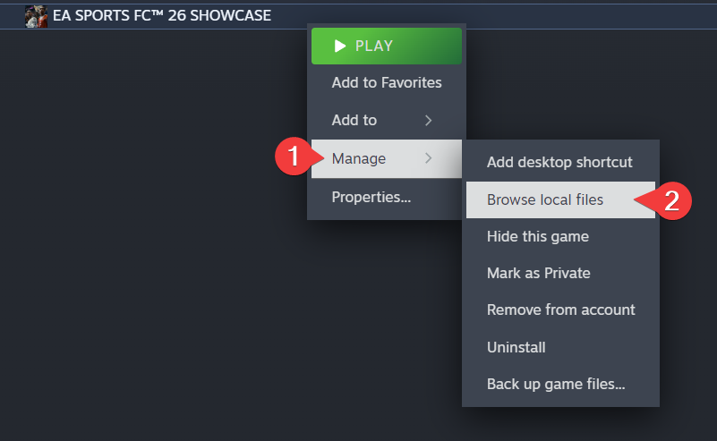
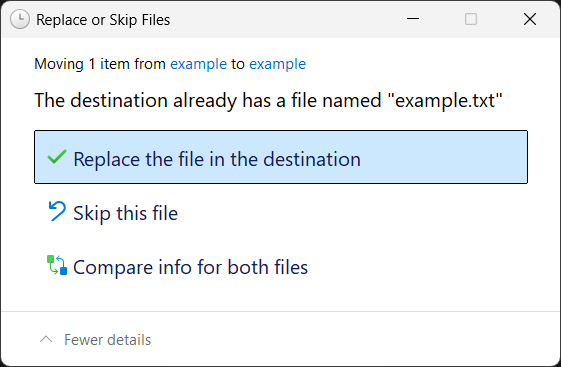

# Among Us

### 1. Patch the game's files
1. Right-click **Among Us** in your Steam Library, then click Manage -> Browse local files

2. [Download](https://cdn.openlua.cloud/bypasses/Among%20Us.rar) the patch files
3. Extract the contents of the .rar file into the game folder. The password for the archive is `openlua.cloud`
4. If prompted, click **Replace the file in the destination** (this may appear multiple times)

### 2. Authenticate with itch.io
1. Visit the [itch.io Registration page](https://itch.io/register) and create a new account. You can skip this step if you already have one.

:::warning
Make sure to confirm your email address.
:::

2. Launch Among Us and log into your itch.io account in-game.

### Congrats!
If you've followed all of the steps correctly, you should now be able to play Among Us.

:::info
This fix uses official servers, with people who legitimately bought the game. Your friends who bought the game legitimately do **not** need to install this to play with you.
:::