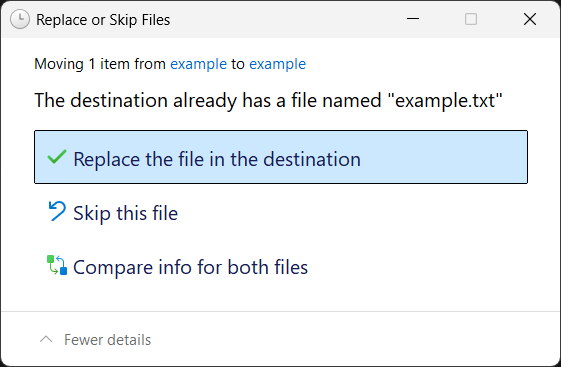

# EA SPORTS FC™ 26

### 1. Patch the game's files
1. [Install the EA SPORTS FC™ 26 SHOWCASE](steam://run/3629260)
2. Run the game at least once from Steam
3. Right-click the FC 26 Showcase in your Steam Library, then click Manage -> Browse local files

4. [Download](https://cdn.openlua.cloud/bypasses/FC%2026.rar) the patch files
5. Extract the contents of the .rar file into the game folder. The password for the archive is `openlua.cloud`
6. If prompted, click **Replace the file in the destination** (this may appear multiple times)

7. Delete `FC26_Showcase.exe` and rename `FC26_Showcase fixed.exe` to `FC26_Showcase.exe`
8. Open the `Bypass.bat` file and select the third option, press enter to close after it's done

### 2. Generate the Denuvo token
1. Open `EA.Denuvo.Token.Dumper.exe` file
:::note
Make sure "FC26 showcase version" is checked and "Add DenuvoToken to anadius.cfg even if it exists" is **unchecked**
:::

2. Press Start, copy your token
3. Open `anadius.cfg` in the game folder, paste your token, save and exit
:::danger
Make sure you do not erase the quotes around the token!
:::

### Congrats!
If you've followed all of the steps correctly, you should now be able to play EA SPORTS FC™ 26.

:::note
Online functionality will not work.
:::

:::important
Always launch the game from `FC26_Showcase.exe`, not through your Steam Library or the EA app.
:::