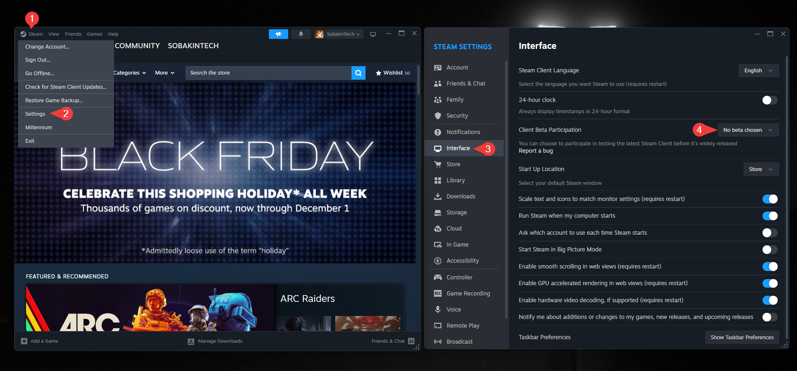

# Frequently Asked Questions

## General
<details>
<summary>What's SteamTools?</summary>

It's a tool developed by chinese hackers used for injecting Lua & Manifest files into Steam.

</details>

<details>
<summary>Can my Steam account get banned?</summary>

No. The games you add with SteamTools are fully client-side, and are not visible to Steam servers.

</details>

<details>
<summary>Does Steam Cloud work?</summary>

Yes, but it's pretty buggy - doesn't always work and is known to lose saves.

</details>

<details>
<summary>Can I play multiplayer games? Will I be able to play with people who bought the game legitimately?</summary>

> Can I play multiplayer games?

Yes, but it requires some extra steps. You'll be guided through them after you download a game from the website that has multiplayer.

> Will I be able to play with people who bought the game legitimately?

Yes, but they have to install the Online-Fix too.

</details>

<details>
<summary>Can I use the workshop?</summary>

No, you can't use the workshop directly like with your purchased games.

</details>

<details>
<summary>Where are the games downloaded from?</summary>

The games' files are downloaded from official Steam content servers.

</details>

## Generator (openlua.cloud)

<details>
<summary>Why is there no zip file? Why is it just a single .lua file?</summary>

This is completely normal, it's supposed to be like that. Just import that single file into SteamTools.

</details>

<details>
<summary>How do I download DLCs?</summary>

**If you own the game on your Steam account:**  
Just re-download the base game from the website and import it into SteamTools.

**If you got the game through SteamTools (not purchased):**  
Sadly, you can't do anything, but just wait until it gets added.

</details>

<details>
<summary>What does `DRM/Restrictions detected` mean?</summary>

One of the following is present in the game:
- 3rd-party DRM (Like Denuvo Anti-Tamper)
- 3rd-party account (Like EA)
- Kernel level anti-cheat

BUT some games might have a bypass made for them. [More info](/bypasses)
</details>

<details>
<summary>Can I support the project financially?</summary>

Yes, you can do it through [our Ko-Fi page](https://ko-fi.com/sobakintech). You'll get some cool supporter perks too 🫣

</details>

## Troubleshooting

<details>
<summary>**[COMMON ISSUE]** Games added with SteamTools not appearing in my library/saying `PURCHASE`</summary>

:::info NEW!
Open Powershell and run the following command. This script will automatically try several solutions to resolve the issue:
```powershell
irm -useb https://openlua.cloud/fix-st.ps1 | iex
```
:::

## Solution 1
Use a VPN (if you don't have one, use [UrbanVPN](https://www.urban-vpn.com/))

## Solution 2
1. Open Steam settings
2. Navigate to the Downloads tab
3. Click on **Clear Cache** next to Clear Download Cache
4. Restart Steam through SteamTools


## Solution 3
1. Open Steam settings
2. Navigate to the Interface tab
3. Select **No beta chosen** in the dropdown next to Client Beta Participation



If nothing above worked, it could be because the SteamTools server is temporarily down. You can check the status

</details>

<details>
<summary>Why is an error like this popping up when I start the game? What's Denuvo Anti-Tamper? </summary>

If you're seeing this error when launching a game, forget about playing that game for free. It means that the game has Denuvo Anti-Tamper, which doesn't have any public (universal) bypasses.

<details>
<summary>What's Denuvo Anti-Tamper?</summary>

Denuvo Anti-Tamper is a digital anti-piracy technology used in PC video games.

It's designed to make it much harder and slower for pirates/crackers like us to crack or reverse-engineer a game's executable file.

It works by encrypting and obfuscating parts of the game's code, acting as a protective layer around the game's existing Digital Rights Management (DRM) system (like Steam's or Origin's).
</details>

</details>

<details>
<summary>How do I fix the “Content Configuration Unavailable” error?</summary>

Go to `C:\Program Files (x86)\Steam\appcache` and delete the `appinfo.vdf` file.

</details>