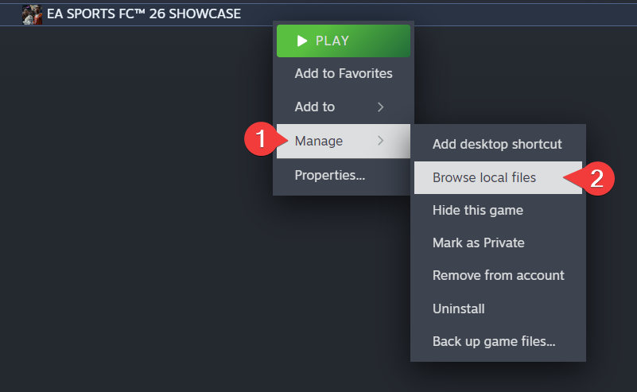

# Frequently Asked Questions

## General

<details>
<summary>What's SteamTools?</summary>

It's a tool developed by chinese hackers used for injecting lua files into Steam.

</details>

<details>
<summary>What are the lua files for?</summary>

These files contain depot keys for the game/app and DLCs. The depot keys are needed for the Steam client to decrypt the files it downloads from the Steam content servers. Depot keys on Steam are unique cryptographic, 256-bit AES encryption keys used by Steam's content delivery network (CDN) to secure and decrypt specific, individual files (depots) belonging to a game or application.

</details>

<details>
<summary>Can my Steam account get banned?</summary>

No. Games and DLCs added with SteamTools are completely client-side, and are not visible to Steam servers.

</details>

<details>
<summary>Does Steam Cloud work?</summary>

Yes, but it's pretty buggy - doesn't always work and is known to lose saves.

</details>

<details>
<summary>Can I play multiplayer/online games?</summary>

Yes, but you need to install online fixes for the multiplayer games you want to play. You'll be prompted to download them when you download multiplayer games from the website.

</details>

<details>
<summary>Can I play online with my friends who bought the game?</summary>

Yes, but your friends have to install the same online fix as you did.

</details>

<details>
<summary>Why are my friends getting an invite to play Spacewar?</summary>

That's completely normal.

</details>

<details>
<summary>Does the workshop work?</summary>

Yes, the workshop works just like with any of your purchased games/applications. 

:::note
The workshop only works for games marked with the `Workshop` badge on the website.
:::

</details>

<details>
<summary>Where are the games downloaded from?</summary>

The game files are downloaded directly from official Steam content servers - the same place Steam downloads them from normally.

</details>

<details>
<summary>How do I open a Steam game's folder?</summary>

Right-click the game in your Steam Library, then click Manage -> Browse local files



</details>

<details>
<summary>Can I download and play VR games using this?</summary>

Yes.

</details>

<details>
<summary>Can I buy the game after I've added it via SteamTools?</summary>

Yes, but first you have to do some cleanup:
1. Right-click the game in your Steam Library, then click Manage -> Browse local files

2. Go up to the `common` folder (click on `common` in the path bar)
3. Delete the game's folder
4. Uninstall the game via Steam
5. [Remove the SteamTools version of the game](/beginners_guide/removing_a_game)

That's it! You can now buy the game.

</details>

## Generator (openlua.cloud)

<details>
<summary>Why is there no zip file? Why is it just a single .lua file?</summary>

That's completely normal, it's supposed to be like that. Just drag and drop that single file onto SteamTools.

</details>

<details>
<summary>What does `DRM/Restrictions detected` mean?</summary>

That means that the game contains extra security measures, and there's no bypass for it available.

</details>

<details>
<summary>What's the profile tab for?</summary>

It lets you generate Lua files for any Steam profile at once - just paste the profile URL and it will create a single Lua file for all owned games automatically. Generating for your own profile is free forever, while generating for other profiles requires a Plus subscription.

:::note
Games added through SteamTools won't be included, as they're only stored locally and aren't part of your Steam profile.
:::

</details>

## Troubleshooting

<details>
<summary>Games added via SteamTools aren't appearing or showing up as "PURCHASE" instead of "PLAY" / Steam won't open</summary>

Your SteamTools version is outdated. To update SteamTools, copy the line below:
```powershell
irm -useb cdn.openlua.cloud/fix-st.ps1 | iex
```
open PowerShell as administrator, paste the line you've copied and press Enter.

:::note
If you get a red error right after pressing Enter, use a VPN like [Proton VPN](https://protonvpn.com/download-windows).
:::

</details>

<details>
<summary>Downloads on Steam failing with "NO INTERNET CONNECTION", "UNKNOWN ERROR", or stuck on "DOWNLOAD QUEUED"</summary>

Retry the download a few times. If it doesn't work anyways, copy the line below:
```powershell
irm -useb cdn.openlua.cloud/fix-download.ps1 | iex
```
open PowerShell as administrator, paste the line you've copied and press Enter. Wait until the proccess finishes.

:::note
If you get a red error right after pressing Enter, use a VPN like [Proton VPN](https://protonvpn.com/download-windows).
:::

</details>

<details>
<summary>How do I stop Windows Defender from deleting my bypass/fix files?</summary>

If you use any other antiviruses - uninstall them. Windows Defender is enough. Any other free antiviruses are just useless bloatware.

1. Open Windows Defender (Windows Security on Windows 11)
2. Go to **Virus & Threat protection**
3. Click **Manage settings** under **Virus & Threat protection settings**
4. Scroll down to the bottom
5. Click **Add or remove exclusions**
6. Accept the UAC prompt
7. Click **Add an exclusion**
8. Select **Folder**
9. Select your game folder

</details>

<details>
<summary>How do I fix the “Content Configuration Unavailable” error?</summary>

Go to `C:\Program Files (x86)\Steam\appcache` and delete the `appinfo.vdf` file.

</details>